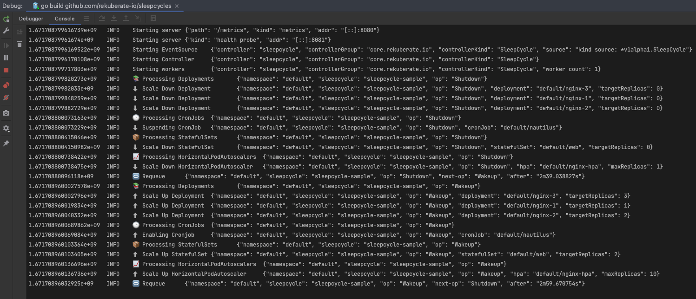

<p align="center">
  
</p>

Define sleep & wake up cycles for your Kubernetes resources. Automatically schedule to shutdown Deployments, CronJobs, StatefulSets and HorizontalPodAutoscalers that occupy resources in your cluster and wake them up only when you need them, reducing that way the overall power consumption.

You can read more in this [article](https://medium.com/@akyriako/rekuberate-io-sleepcycles-an-automated-way-to-reclaim-your-unused-kubernetes-resources-852e8db313ec).

## Getting Started
You’ll need a Kubernetes cluster to run against. You can use [KIND](https://sigs.k8s.io/kind) or [K3D](https://k3d.io) to get a local cluster for testing, or run against a remote cluster.
**Note:** Your controller will automatically use the current context in your kubeconfig file (i.e. whatever cluster `kubectl cluster-info` shows).

Under `config/samples` you will find an example manifest that you can use to test this controller:

```yaml
apiVersion: core.rekuberate.io/v1alpha1
kind: SleepCycle
metadata:
  name: sleepcycle-sample
spec:
  shutdown: "0 20 * * *"
  shutdownTimeZone: "Europe/Athens"
  wakeup: "30 7 * * 1-5"
  wakeupTimeZone: "Europe/Dublin"
  enabled: true
```

You need to provide to every `SleepCycle` the `shutdown` (mandatory) and `wakeup` (non-mandatory) policies via Cron expressions (**do not include seconds or timezone**). 
Additionally you can provide schedules on different timezones via the (non-mandatory) fields `shutdownTimeZone` and  `wakeupTimeZone`. If they're not provided they default to **UTC**.
The example above will set a `SleepCycle` schedule shutting down  your workloads **every day at 20:00 Athens local time** and waking them up **every weekday at 07:30 Dublin local time**.

`SleepCycle` is a Namespaced Custom Resource, and the controller will monitor all the resources in the Namespace you installed the
`SleepCycle` manifest and they are marked with a `Label` that has as key `rekuberate.io/sleepcycle:` and as value the `name` of the manifest you created:

```yaml
apiVersion: apps/v1
kind: Deployment
metadata:
  labels:
    app: nginx-demo
    rekuberate.io/sleepcycle: sleepcycle-sample
  name: nginx-demo
  namespace: default
spec:
  ...
  ...
```

### Running on the cluster

1. Build and push your image to the location specified by `IMG` in `Makefile`:

```shell
# Image URL to use all building/pushing image targets
IMG_TAG ?= $(shell git rev-parse --short HEAD)
IMG_NAME ?= rekuberate-io-sleepcycles
DOCKER_HUB_NAME ?= $(shell docker info | sed '/Username:/!d;s/.* //')
IMG ?= $(DOCKER_HUB_NAME)/$(IMG_NAME):$(IMG_TAG)
```

```sh
make docker-build docker-push
```

2. Deploy the controller to the cluster with the image using `IMG`:

```sh
make deploy
```

or

3. Deploy the controller to the cluster with the image using Helm chart:

```sh
helm install rekuberate-io-sleepcycles config/helm/
```

4. Install Instances of Custom Resources:

```sh
kubectl apply -f config/samples/
```

### Uninstall CRDs
To delete the CRDs from the cluster:

```sh
make uninstall
```

### Undeploy controller
UnDeploy the controller to the cluster:

```sh
make undeploy
```
or if you have installed via Helm:

```shell
helm uninstall rekuberate-io-sleepcycles
```

## Contributing
Please refer to our [Contributing Guidelines](CONTRIBUTING.md)

### How it works
This project aims to follow the Kubernetes [Operator pattern](https://kubernetes.io/docs/concepts/extend-kubernetes/operator/)

It uses [Controllers](https://kubernetes.io/docs/concepts/architecture/controller/) 
which provides a reconcile function responsible for synchronizing resources untile the desired state is reached on the cluster 

### Test It Out
1. Install the CRDs into the cluster:

```sh
make install
```

2. Run your controller (this will run in the foreground, so switch to a new terminal if you want to leave it running):

```sh
make run
```



**NOTE:** You can also run this in one step by running: `make install run`

### Modifying the API definitions
If you are editing the API definitions, generate the manifests such as CRs or CRDs using:

```sh
make generate
make manifests
```

then install the CRDs in the cluster with:

```sh
make install
```

**NOTE:** You can debug the controller in the IDE of your choice by hooking to the main.go or you can start
the controller without debugging with:

```sh
make run
```

**NOTE:** Run `make --help` for more information on all potential `make` targets

More information can be found via the [Kubebuilder Documentation](https://book.kubebuilder.io/introduction.html)

## License

Copyright 2022.

Licensed under the Apache License, Version 2.0 (the "License");
you may not use this file except in compliance with the License.
You may obtain a copy of the License at

    http://www.apache.org/licenses/LICENSE-2.0

Unless required by applicable law or agreed to in writing, software
distributed under the License is distributed on an "AS IS" BASIS,
WITHOUT WARRANTIES OR CONDITIONS OF ANY KIND, either express or implied.
See the License for the specific language governing permissions and
limitations under the License.

